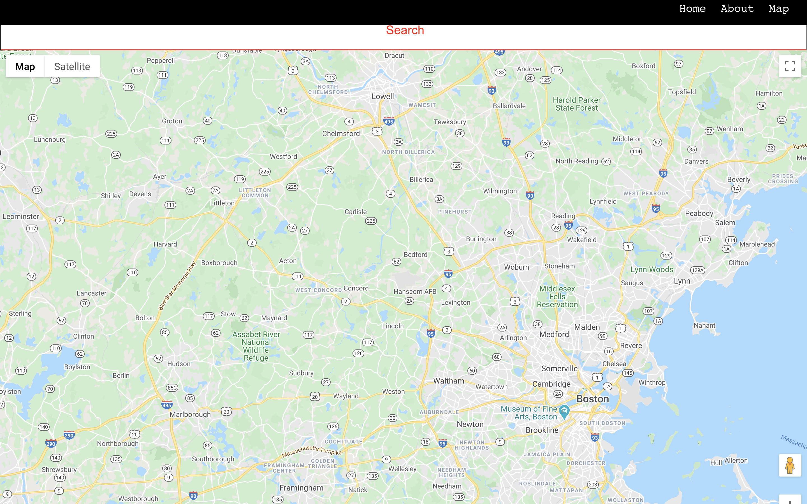

# 🚀 Welcome to SNAP App Locator!

SNAP stands for the Supplemental Nutrition Assistance Program mandated by the Federal Government and supervised by states to help millions of individuals and families who need financial assistance to buy food. Formerly known as the Food Stamp Program, SNAP provides an economic benefit as well as serving to eliminate hunger. 

SNAP Store locator is an application that helps users find access to SNAP retailers and grocers.
Communities suffer disproportionately from illness related to lack of access to fresh and healthy foods.
SNAP Store Locator will allow the user to search for retailers and grocers nearby that accept SNAP benefits. 

API: snap_locator_api: https://github.com/alyrlee/snap_locator_api

How to get started?

You can start by clicking on the "Get Started" button and you will be taken to the map.

<hr>




```
Technologies used:
```

```
Client:
```

<br>
Javascript: https://www.javascript.com/
CSS: https://developer.mozilla.org/en-US/docs/Web/CSS
React.js: https://reactjs.org/
React-Router-Dom: https://reactrouter.com/web/guides/quick-start
History: https://reactrouter.com/web/api/Hooks/usehistory
<br>

```
Server:
```

<br> 
Node.js: https://nodejs.org/en/
Express.js: https://expressjs.com/
Morgan: https://github.com/expressjs/morgan#readme
Cors: https://developer.mozilla.org/en-US/docs/Web/HTTP/CORS
Helmet: https://helmetjs.github.io/
XSS: https://jsxss.com/en/index.html
Nodemon: https://nodemon.io/
Knex: https://knexjs.org/#Installation-client
Dotenv: https://github.com/motdotla/dotenv#readme
postgreSql: https://www.postgresql.org/

<br>
```
Testing with:
```

<br>
Chai: https://www.chaijs.com/plugins/chai-react-element/
Mocha: https://mochajs.org/
Supertest: https://github.com/visionmedia/supertest#readme
<br>

```
APIs: 
```
<br>
google-maps-react: https://github.com/fullstackreact/google-maps-react#readme
react-google-autocomplete: https://github.com/ErrorPro/react-google-autocomplete#readme
react-geocode: https://github.com/shukerullah/react-geocode#readme
<br>


## Considerataions for app development:

Future implementation of registered user savedLocations route to render dashboard in the user profile that displays store information and user saved information in regard to snap retailer locations.

See below for instructions on how to run and modify this application locally after cloning the repository.


## Available Scripts

In the project directory, you can run:

### `yarn start`

Runs the app in the development mode.<br>
Open [http://localhost:3000](http://localhost:3000) to view it in the browser.

The page will reload if you make edits.<br>
You will also see any lint errors in the console.

**NOTE**: in order to see linting rules in your editor, you will need to install eslint globally (i.e. `npm i -g eslint`).

### `yarn test`

Launches the test runner in the interactive watch mode.<br>
See the section about [running tests](https://facebook.github.io/create-react-app/docs/running-tests) for more information.

### `yarn run build`

Builds the app for production to the `build` folder.<br>
It correctly bundles React in production mode and optimizes the build for the best performance.

The build is minified and the filenames include the hashes.<br>
Your app is ready to be deployed!

### `yarn run deploy`

Deploy the built application to https://surge.sh/. You will need to update this script in package.json to point to your own surge domain.

See the section about [deploying to surge](https://facebook.github.io/create-react-app/docs/deployment#surge-https-surgesh) for more information.

### `yarn run eject`

**Note: this is a one-way operation. Once you `eject`, you can’t go back!**

If you aren’t satisfied with the build tool and configuration choices, you can `eject` at any time. This command will remove the single build dependency from your project.

Instead, it will copy all the configuration files and the transitive dependencies (Webpack, Babel, ESLint, etc) right into your project so you have full control over them. All of the commands except `eject` will still work, but they will point to the copied scripts so you can tweak them. At this point you’re on your own.

You don’t have to ever use `eject`. The curated feature set is suitable for small and middle deployments, and you shouldn’t feel obligated to use this feature. However we understand that this tool wouldn’t be useful if you couldn’t customize it when you are ready for it.

## Learn More

You can learn more in the [Create React App documentation](https://facebook.github.io/create-react-app/docs/getting-started).

To learn React, check out the [React documentation](https://reactjs.org/).

### Code Splitting

This section has moved here: https://facebook.github.io/create-react-app/docs/code-splitting

### Analyzing the Bundle Size

This section has moved here: https://facebook.github.io/create-react-app/docs/analyzing-the-bundle-size

### Making a Progressive Web App

This section has moved here: https://facebook.github.io/create-react-app/docs/making-a-progressive-web-app

### Advanced Configuration

This section has moved here: https://facebook.github.io/create-react-app/docs/advanced-configuration

### Deployment

This section has moved here: https://facebook.github.io/create-react-app/docs/deployment

### `yarn run build` fails to minify

This section has moved here: https://facebook.github.io/create-react-app/docs/troubleshooting#npm-run-build-fails-to-minify

[create-react-app]: https://facebook.github.io/create-react-app/
[react]: https://reactjs.org/
